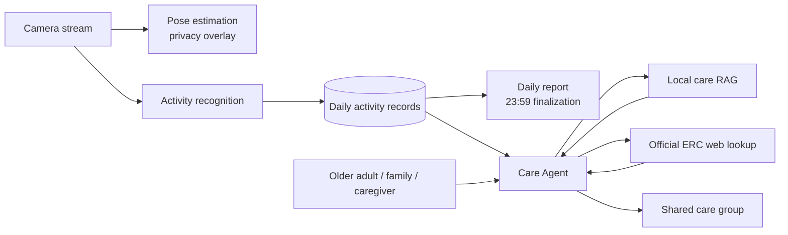

# ElderCare

ElderCare is an AI-assisted home safety and elder-care monitoring concept for older adults, family members, and caregivers.

It combines privacy-preserving camera monitoring, activity recognition, daily reports, local care guidance, and official elder-care resource lookup in one shared care experience.

> This repository is a product showcase and architecture overview. It intentionally does not include application source code, model weights, private data, credentials, or deployment secrets.

## Product Highlights

- Privacy-aware camera monitoring with pose visualization
- Daily activity timeline for normal routines and safety events
- Urgent and warning event classification
- Daily reports with activity category proportions
- Care Agent for questions, summaries, and practical guidance
- Local RAG knowledge retrieval for care information
- Official Housing Society Elderly Resources Centre lookup
- Shared care-group concept for older adults, family, and caregivers

## Architecture

See [`docs/architecture.md`](docs/architecture.md) for the detailed data flow.

## Core Workflows

### Monitoring and Events

<table><tr><td width="46%"></td><td>Camera status, privacy-aware monitoring, daily routine events, and attention levels are shown in one overview. Routine activity is separated from urgent and warning events so families can focus on what needs follow-up.</td></tr></table>

### Daily Reports

<table><tr><td width="46%"></td><td>The completed day's report is finalized at 23:59. It includes activity volume, category proportions, common activities, attention levels, and the recorded time range. Before the current day is complete, the previous completed report remains visible.</td></tr></table>

### Care Agent and Knowledge Retrieval

<table><tr><td width="46%"></td><td>The Care Agent answers practical care questions, summarizes activity, and combines local RAG knowledge with official Housing Society Elderly Resources Centre lookup when current resource information is needed.</td></tr></table>

### Shared Care Group

<table><tr><td width="46%"></td><td>An older adult, family members, and caregivers can share one care circle. Group management provides a place for membership, access, shared updates, and family invitations.</td></tr></table>

Screenshots are captured from the local product prototype with identifying data excluded.

## Privacy and Safety

- Camera privacy visualization is part of the product concept.
- Real user names, addresses, camera URLs, service credentials, and databases are excluded from this repository.
- The system is an assistive monitoring prototype and does not replace medical professionals or emergency services.
- AI activity recognition and generated guidance may be inaccurate and should be reviewed by a responsible caregiver.

## Repository Scope

This public repository contains documentation and product materials only:

- Product overview
- Architecture documentation
- Feature descriptions
- Screenshot and demo asset index
- Privacy and limitation notes

It does not contain the private application's source code or runtime assets.

## License

See [`LICENSE`](LICENSE).
