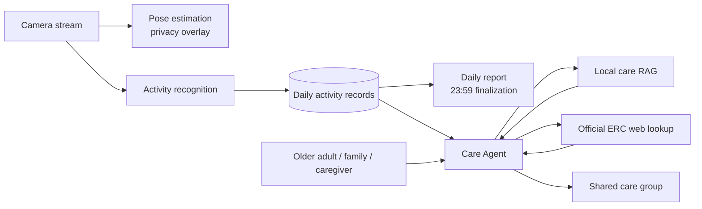

# ElderCare

ElderCare is an AI-assisted home safety and elder-care monitoring concept for older adults, family members, and caregivers.

It combines privacy-preserving camera monitoring, activity recognition, daily reports, local care guidance, and official elder-care resource lookup in one shared care experience.

> This repository is a product showcase and architecture overview. It intentionally does not include application source code, model weights, private data, credentials, or deployment secrets.

## Product Highlights

- Privacy-aware camera monitoring with pose visualization
- Daily activity timeline for normal routines and safety events
- Urgent and warning event classification
- Daily reports with activity category proportions
- Care Agent for questions, summaries, and practical guidance
- Local RAG knowledge retrieval for care information
- Official Housing Society Elderly Resources Centre lookup
- Shared care-group concept for older adults, family, and caregivers

## Product Screens

### Overview

### Reports

### Care Agent

### Shared Care Group Settings

Screenshots are captured from the local product prototype with identifying data excluded.

## Architecture

See [`docs/architecture.md`](docs/architecture.md) for the detailed data flow.

## Core Workflows

### Monitoring

Camera frames are processed for activity understanding and privacy-aware visualization. The interface presents routine events separately from urgent or warning events.

### Care Agent

The Agent combines recent care context, local care knowledge, and official Housing Society Elderly Resources Centre information when relevant. Official web lookup is restricted to approved sources and is used for current activities, services, visit information, and related resources.

### Daily Report

A completed daily report is generated at 23:59. Before the current day is complete, the Reports view shows the latest completed day's report rather than an empty partial report. The report includes activity volume, category proportions, common activities, attention levels, and the recorded time range.

### Shared Care Group

The product is designed for a shared care circle. An older adult can be supported by family members and caregivers who share access to the same home-safety context, events, and daily reports.

## Privacy and Safety

- Camera privacy visualization is part of the product concept.
- Real user names, addresses, camera URLs, service credentials, and databases are excluded from this repository.
- The system is an assistive monitoring prototype and does not replace medical professionals or emergency services.
- AI activity recognition and generated guidance may be inaccurate and should be reviewed by a responsible caregiver.

## Repository Scope

This public repository contains documentation and product materials only:

- Product overview
- Architecture documentation
- Feature descriptions
- Screenshot and demo asset index
- Privacy and limitation notes

It does not contain the private application's source code or runtime assets.

## License

See [`LICENSE`](LICENSE).
