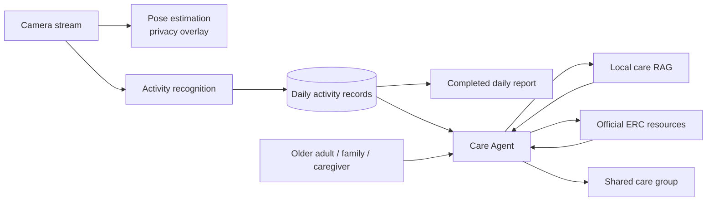
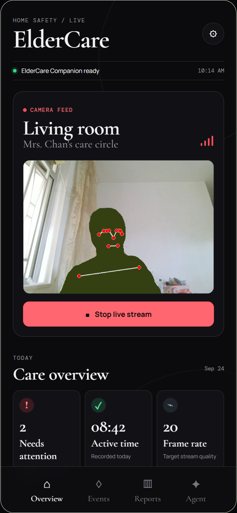
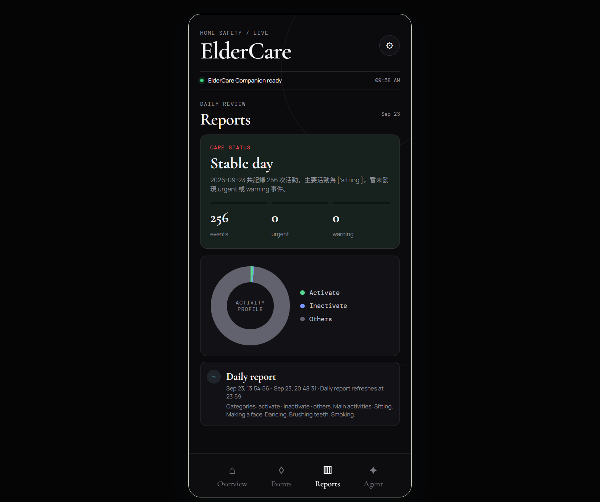
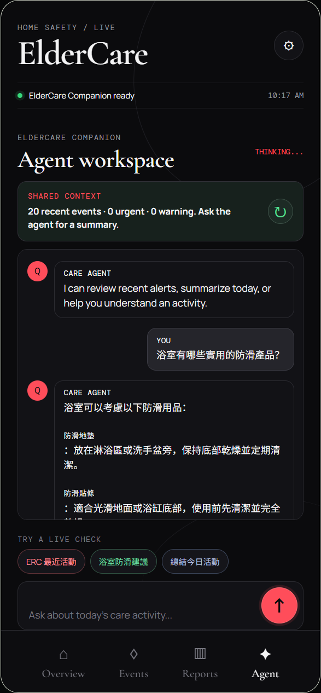
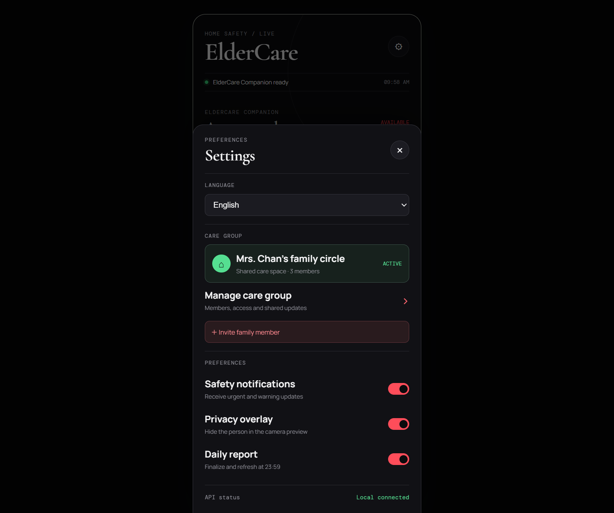

# ElderCare

ElderCare is an AI-agent-assisted home safety and elder-care platform for older adults, family members, and caregivers.

Its Care Agent combines privacy-preserving camera monitoring, activity recognition, daily reports, local care guidance, and official elder-care resources in one shared care experience.

## Product Highlights

- Camera monitoring with pose visualization only, keeping the visible person private while preserving movement context
- Daily activity timeline for normal routines and safety events
- Instant notifications for urgent and warning events
- Daily reports with activity category proportions
- Care Agent for queries, summaries, and practical guidance
- Local RAG knowledge retrieval for official care information
- Official Housing Society Elderly Resources Centre information
- Shared care-group concept for older adults, family, and caregivers

## Architecture

See [`docs/architecture.md`](docs/architecture.md) for the detailed data flow.

## Core Workflows

### Monitoring and Events

<table><tr><td width="46%"></td><td>Camera status, privacy-aware monitoring, daily routine events, and attention levels are shown in one overview. Routine activity is separated from urgent and warning events so families can focus on what needs follow-up.</td></tr></table>

### Daily Reports

<table><tr><td width="46%"></td><td>The completed daily report includes activity volume, category proportions, common activities, attention levels, and the recorded time range. The product keeps the latest completed report visible between daily updates.</td></tr></table>

### Care Agent and Guidance

<table><tr><td width="46%"></td><td>The Care Agent is the central interaction layer. It answers care queries, summarizes activity, combines local RAG with official Housing Society Elderly Resources Centre information, and shows the source used for guidance.</td></tr></table>

### Shared Care Group

<table><tr><td width="46%"></td><td>An older adult, family members, and caregivers can share one care circle. Group management provides a place for membership, access, shared updates, and family invitations.</td></tr></table>

## Agent Safety

The Care Agent follows a safety boundary designed for family and caregiver use:

- It does not reveal private personal information, credentials, camera URLs, or hidden system data.
- It avoids medical diagnosis and medication changes.
- It escalates emergencies such as falls, chest pain, breathing difficulty, loss of consciousness, suspected stroke, serious injury, or self-harm risk.
- It uses retrieved care knowledge and official resources as supporting information, not as a replacement for professional care.
- It states uncertainty instead of inventing unavailable addresses, schedules, or services.
