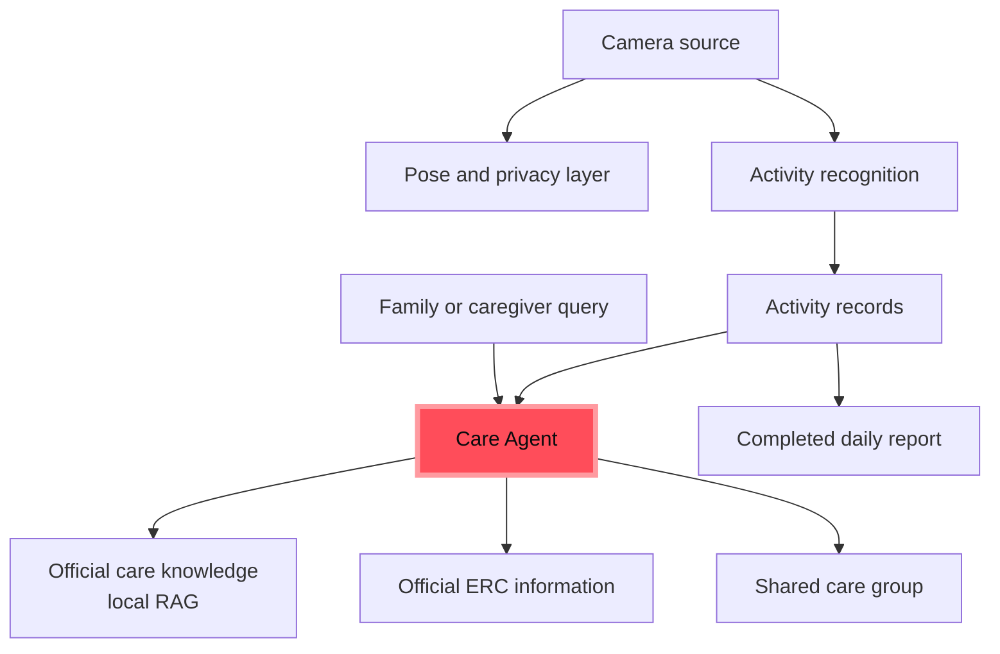

# Architecture Overview

## System Context

ElderCare is organized around a continuous camera pipeline, a local activity record store, and an Agent-centered care layer.

## Data Flow

1. The camera provides frames for monitoring.
2. Pose estimation creates a privacy-aware visual representation.
3. Activity recognition classifies observed routines and safety-related events.
4. Activity records are stored locally with timestamps and levels.
5. The reporting layer keeps the latest completed daily report available between daily updates.
6. The Care Agent receives compact daily statistics rather than an unbounded raw event list.
7. Local RAG supplies stable care guidance.
8. Official ERC resources supply current Housing Society information when a query requires it.
9. Family members and caregivers access the shared care context through the product interface.

## Report Categories

The reporting layer groups events into:

- `urgent`
- `warning`
- `activate`
- `inactivate`
- `others`

The UI presents category proportions as a donut chart and provides a readable daily summary.

## Official Resource Boundary

ERC resource retrieval is intentionally restricted to official Housing Society domains. It uses short-lived caching, request timeouts, and source URLs so current official information can be distinguished from local knowledge.

## Resource Constraints

The runtime is designed for a consumer laptop GPU. Model prompts are compacted by aggregating daily activity counts and retaining only a small recent-event sample. This prevents a large daily history from exhausting GPU memory.
